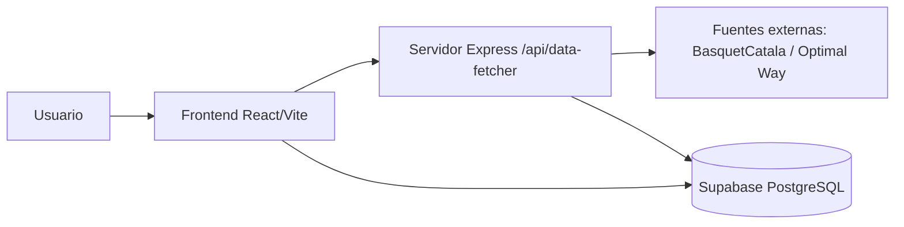

# Documento de arquitectura

## 1. Resumen ejecutivo

Esta solución es una aplicación web para extraer información de partidos de baloncesto desde fuentes externas y cargarla de forma estructurada en Supabase. La arquitectura combina una interfaz de usuario React con un servidor Express que actúa como proxy para sortear problemas de CORS y proteger la lógica de acceso a servicios externos.

La solución está pensada para:
- recoger datos desde páginas y APIs públicas;
- normalizar los datos en un modelo interno;
- persistirlos en PostgreSQL a través de Supabase;
- ofrecer una experiencia operativa sencilla desde un frontend ligero.

---

## 2. Objetivo de la arquitectura

La arquitectura busca equilibrar tres aspectos:
1. Simplicidad operativa para el usuario final.
2. Robustez frente a bloqueos de acceso y restricciones de navegador.
3. Persistencia estructurada y trazable de los datos extraídos.

---

## 3. Stack tecnológico

| Capa | Tecnología | Propósito |
| --- | --- | --- |
| Frontend | React 19 + TypeScript | Interfaz de usuario y experiencia operativa |
| Build/Vite | Vite 6 | Desarrollo rápido, bundling y despliegue estático |
| Estilos | Tailwind CSS + Motion + Lucide React | UI moderna, animaciones e iconografía |
| Backend | Express + Node.js | Servidor proxy para peticiones externas |
| Gestión de datos | Supabase (PostgreSQL + cliente JS) | Persistencia, consultas y upsert |
| Scraping/fetch | fetch API + JSZip | Recuperación de HTML/JSON y exportación ZIP |
| Variables de entorno | dotenv | Configuración de credenciales y endpoints |
| Lenguaje | TypeScript | Tipado fuerte y mantenimiento del código |

---

## 4. Arquitectura general

### Componentes principales
- Frontend: se encarga de lanzar los procesos de scraping, mostrar logs y enviar los datos a la capa de persistencia.
- Servidor Express: centraliza las peticiones a servicios externos para evitar restricciones de navegador y reutilizar lógica de cabeceras.
- Supabase: almacena los datos de categorías, temporadas, competiciones, clubes, equipos, partidos, jugadores, estadísticas y movimientos.

---

## 5. Flujo funcional

### 5.1 Extracción de datos
1. El usuario inicia una operación desde la interfaz.
2. El frontend invoca el servicio de scraping.
3. El servicio intenta recuperar HTML o JSON desde la fuente externa mediante varios mecanismos de proxy.
4. Si la fuente está bloqueada por CORS o filtros de seguridad, se usa el endpoint local del servidor Express.

### 5.2 Transformación y normalización
1. El HTML/JSON se parsea y se convierten los datos en un modelo interno.
2. Se identifican entidades como partidos, equipos, jugadores y movimientos.
3. Se generan estructuras listas para insertar o actualizar en base de datos.

### 5.3 Persistencia
1. Se ejecuta un proceso de upsert por entidad.
2. Se eliminan datos previos del partido antes de insertar estadísticas o movimientos nuevos.
3. Se preservan los identificadores externos para mantener consistencia y permitir rehidratación.

---

## 6. Modelo de identificación

La solución usa un modelo híbrido de identificación:

### 6.1 Identificadores externos
Se conservan valores como:
- `idMatchExtern`
- `idMatchIntern`
- `actorId`
- `teamIdIntern`

Estos permiten vincular registros con la fuente original y evitar duplicidades cuando los mismos datos se vuelven a procesar.

### 6.2 Claves de negocio o naturales
Se emplean claves de negocio para upsert en base de datos:
- `temporadas.nombre`
- `categorias.nombre`
- `competiciones(nombre, temporada_id, categoria_id)`
- `clubs.nombre`
- `equipos(club_id, competicion_id)`
- `jugadores.nombre_completo` con soporte de `actor_id`

Este enfoque hace que la carga sea idempotente: si el mismo dato se procesa dos veces, no genera duplicados innecesarios.

### 6.3 Estrategia de consistencia
- Los partidos se insertan o actualizan por `id_match_extern`.
- Las estadísticas de jugador se asocian por `partido_id + jugador_id`.
- Se hacen limpiezas previas para evitar datos obsoletos en un mismo partido.

---

## 7. Persistencia

### 7.1 Motor de base de datos
- Supabase usa PostgreSQL como motor de persistencia.
- La lógica de acceso se implementa mediante el cliente oficial de Supabase para JavaScript.

### 7.2 Entidades principales
- `temporadas`
- `categorias`
- `competiciones`
- `clubs`
- `equipos`
- `partidos`
- `jugadores`
- `plantillas`
- `estadisticas_jugador_partido`
- `detalle_tiros_jugador`
- `partido_marcador_evolucion`
- `partido_movimientos`

### 7.3 Consideración arquitectónica relevante
La capa de persistencia está diseñada para soportar tanto cargas de prueba como cargas reales. El servicio incluye un modo mock para validar el flujo sin escribir datos reales, y un modo production que realiza el upsert completo en Supabase.

---

## 8. Integración con aplicaciones externas

### 8.1 Fuentes de datos
La aplicación consume datos de:
- la web de BasquetCatala;
- la API de resultados/estadísticas de Optimal Way Consulting;
- proxies temporales o alternativos cuando la conexión directa queda bloqueada.

### 8.2 Mecanismo de conexión
El servidor Express expone el endpoint [server.ts](server.ts) para recuperar recursos desde el servidor en vez de desde el navegador. Esto reduce problemas de CORS y mejora la fiabilidad de la extracción.

### 8.3 Estrategia de resiliencia
- rotación de proveedores de proxy;
- timeout de peticiones;
- reintentos con jitter;
- detección de bloqueos por seguridad o Cloudflare;
- manejo de respuestas HTML/JSON según el tipo de contenido.

---

## 9. Seguridad

### 9.1 Principios aplicados
- Se usan variables de entorno para configuraciones sensibles.
- No se hardcodean secretos en el código principal.
- El servidor proxy centraliza el acceso a recursos externos.

### 9.2 Puntos a reforzar en producción
Aunque la arquitectura actual es funcional, se recomienda reforzar lo siguiente:
- mover la configuración de Supabase a un backend propio más controlado;
- evitar exponer claves de acceso públicas en el cliente cuando el uso real lo requiera;
- aplicar Row Level Security (RLS) en Supabase y definir permisos por rol;
- añadir autenticación de usuario si se desea un uso multiusuario o empresarial;
- registrar y auditar operaciones sensibles y cargas masivas.

### 9.3 Riesgos actuales
- El cliente actual inicializa Supabase con una clave anónima en [src/lib/supabase.ts](src/lib/supabase.ts), lo cual es adecuado para prototipos, pero debe revisarse para entornos de producción con necesidades reales de control de acceso.
- La lógica de scraping depende de fuentes externas que pueden cambiar su estructura o bloquear automatizaciones.

---

## 10. Librerías y dependencias clave

### Frontend
- React: construcción de la interfaz.
- Vite: herramienta de desarrollo y build.
- Tailwind CSS: estilos.
- Motion: animaciones.
- Lucide React: iconografía.

### Backend y transporte
- Express: servidor HTTP.
- dotenv: configuración de entorno.
- fetch API: recuperación de recursos externos.

### Persistencia y utilidades
- Supabase JS SDK: conexión a PostgreSQL.
- JSZip: exportación de datos en archivos comprimidos.

---

## 11. Consideraciones de despliegue

La solución está preparada para ejecutarse de forma local con Vite y Express. Para producción, las opciones recomendadas son entornos con soporte a Node.js, por ejemplo:
- Vercel
- Render
- Railway
- Fly.io
- un VPS con Node.js y reverse proxy

Importante: GitHub Pages solo serviría la parte estática, pero no ejecutaría el servidor Express, por lo que el proxy de scraping dejaría de funcionar en ese entorno.

---

## 12. Recomendaciones de evolución

1. Separar aún más la capa de negocio del frontend.
2. Implementar un backend de API propio con autenticación y gestión de sesiones.
3. Añadir tests de integración para los servicios de scraping y carga a Supabase.
4. Introducir cola de trabajos para cargas masivas y reintentos controlados.
5. Añadir observabilidad con logs estructurados y métricas de ejecución.

---

## 13. Conclusión

La arquitectura actual es una solución pragmática y modular para scraping + carga de datos, con un frontend ligero, un servidor proxy para lidiar con restricciones externas y una base de datos relacional gestionada en Supabase. Es una base sólida para un MVP o una herramienta interna, y tiene margen para evolucionar hacia una arquitectura más segura, escalable y operativa.
